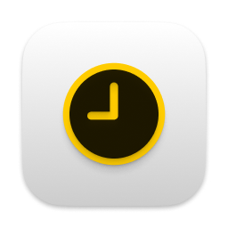
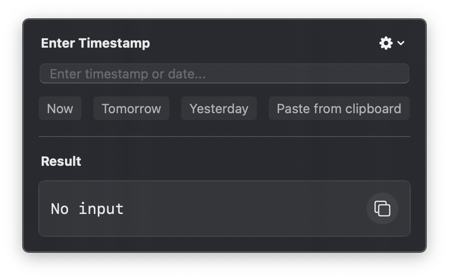
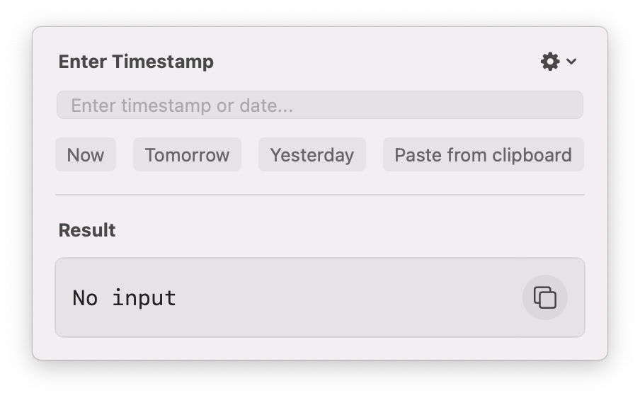

# Epoch2Date

  

A native macOS menubar app for quick and easy Unix timestamp conversions. Convert timestamps to human-readable dates and vice versa, right from your menubar – no browser needed!

## Features

- 🕒 Convert Unix timestamps to human-readable dates
- 📅 Convert dates to Unix timestamps
- ⚡️ Quick preset buttons for common dates:
  - Now
  - Tomorrow
  - Yesterday
- 📋 Clipboard integration:
  - Paste timestamps/dates directly from clipboard
  - Copy conversion results with one click
- ⚙️ Customizable settings:
  - Multiple timestamp units (seconds/milliseconds)
  - Configurable input/output date formats
  - Launch at login option
- 🎨 Supports both light and dark modes

## Screenshots

  
  

## Why Epoch2Date?

Ever found yourself constantly switching to a browser tab just to convert timestamps? Epoch2Date brings this functionality right to your macOS menubar, making it accessible from anywhere on your Mac. No more context switching or browser dependencies!

## Installation

1. Download the latest version from the [Releases](https://github.com/saiyalamarty/Epoch2Date/releases) page
2. Move Epoch2Date.app to your Applications folder
3. Launch the app
4. (Optional) Enable "Launch at login" in the app settings

## Usage

1. Click the Epoch2Date icon in your menubar
2. Enter a Unix timestamp or date string in the input field
3. Use preset buttons for quick conversions:
   - "Now" - Current timestamp
   - "Tomorrow" - Tomorrow's date
   - "Yesterday" - Yesterday's date
4. Click "Copy" to copy the conversion result
5. Use "Paste" to quickly input from clipboard

## Settings

Access settings through the gear icon to customize:

- Timestamp units:
  - Seconds
  - Milliseconds
- Time Zone:
  - Any valid time zone identifier
- Date Input Order:
  - Month/Day/Year
  - Day/Month/Year
- Date Output Format:
  - MMMM d, yyyy (e.g., January 24, 2025)
  - MMM d, yyyy (e.g., Jan 24, 2025)
  - MM/dd/yyyy (e.g., 01/24/2025)
  - dd/MM/yyyy (e.g., 24/01/2025)
  - yyyy-MM-dd (e.g., 2025-01-24)
- Time Output Format:
  - Don't display time
  - h:mm:ss a (e.g., 3:30:45 PM)
  - h:mm a (e.g., 3:30 PM)
  - H:mm:ss (e.g., 15:30:45)
  - H:mm (e.g., 15:30)
- Launch at login preference

## System Requirements

- macOS 10.15 (Catalina) or later
- Apple Silicon or Intel processor

## Support

Found a bug or have a feature request? Please open an issue on our [GitHub repository](https://github.com/saiyalamarty/Epoch2Date/issues).

## License

MIT License - see [LICENSE](LICENSE) for details

---

Made with ❤️ for developers who love clean, efficient tools
